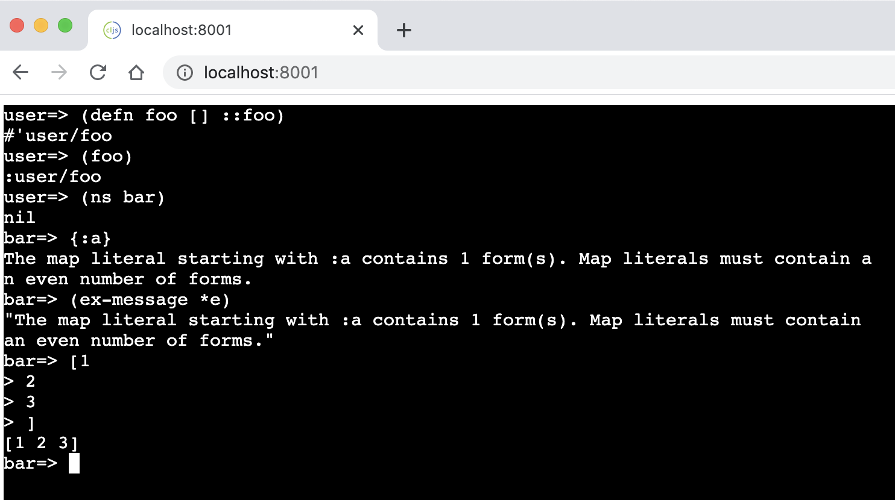

# {project}

<!-- badges -->
[](https://circleci.com/gh/lambdaisland/{project}) [](https://cljdoc.org/d/lambdaisland/{project}) [](https://clojars.org/lambdaisland/{project})
<!-- /badges -->

## Dev

```
$ npm install
$ clojure -A:dev -m shadow.cljs.devtools.cli watch main
```



## Release

Static files including compiled JS are hosted on Github. This is set up like
described
[here](https://medium.com/linagora-engineering/deploying-your-js-app-to-github-pages-the-easy-way-or-not-1ef8c48424b7):

All the commands below assume that you already have a git project initialized and that you are in its root folder.

```
# Create an orphan branch named gh-pages
git checkout --orphan gh-pages
# Remove all files from staging
git rm -rf .
# Create an empty commit so that you will be able to push on the branch next
git commit --allow-empty -m "Init empty branch"
# Push the branch
git push origin gh-pages
```

Now that the branch is created and pushed to origin, let’s configure the worktree correctly:

```
# Come back to master
git checkout master
# Add gh-pages to .gitignore
echo "gh-pages/" >> .gitignore
git worktree add gh-pages gh-pages
```

To deploy to Github Pages:

```
script/release
cd gh-pages
git add .
git commit -m "update build"
git push
```

## License

Copyright &copy; 2020 Arne Brasseur and Contributors

Licensed under the term of the Mozilla Public License 2.0, see LICENSE.

Available under the terms of the Eclipse Public License 1.0, see LICENSE.txt
